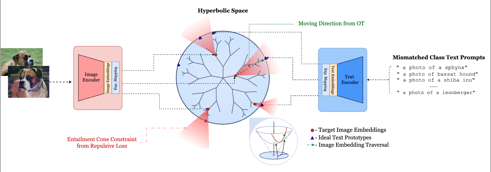

# DIET: Machine Unlearning on a Data-Diet


## News

<!-- - [16-11-2025]C -->
- [08-11-2025] AAAI-26 Oral: Our paper "DIET: Machine Unlearning on a Data-Diet" has been accepted to the AAAI-26 Main Technical Track for an oral presentation.


## Overview

DIET is a **retain-data-free unlearning** method for Vision-Language Models (VLMs). The method leverages hyperbolic geometry to push forget embeddings toward class-mismatched prototypes at the boundary of the Poincaré ball, where their influence becomes asymptotically negligible. Using the Busemann function and adaptive optimal transport, DIET guides forgetting trajectories along geodesics while preserving model utility.

Experiments on fine-grained datasets (Flowers102, OxfordPets, StanfordCars) show that DIET achieves 8.06% forget accuracy while preserving 69.04% utility using only 16 samples per concept, outperforming retain-free baselines by **117.5%** in model utility and achieving competitive performance to retain-data baselines with only a **3.79%** drop.




## Supported Datasets

### Standard 
- CIFAR-10
- CIFAR-100
- SVHN

### Finegrained 
- OxfordPets
- OxfordFlowers
- EuroSAT
- StanfordCars
- Food101
- SUN397
- Caltech101
- UCF101


## Installation

1. Clone the repository:
```bash
git clone <repository-url>
cd DIET
```

2. Install dependencies:
```bash
pip install torch torchvision
pip install clip
pip install geoopt
pip install tqdm numpy
```


## Usage

### 1. Baseline LoRA Experiments

Run baseline LoRA unlearning experiments:

```bash
chmod +x run_baseline.sh
./run_baseline.sh
```

**Configuration**: Edit `run_baseline.sh` to modify:
- Datasets: `DATASETS_TO_RUN="cifar10 cifar100"`
- Seeds: `SEEDS_TO_RUN="1 2 3 4 5"`
- GPU: `GPU_ID="0"`
- LoRA parameters: `LORA_R=4`, `LORA_ALPHA=4`

### 2. Semantic LoRA (Hyp-Busemann) Experiments

Run semantic LoRA experiments with hyperbolic geometry:

```bash
chmod +x run_semantic.sh
./run_semantic.sh /path/to/data
```

**Configuration**: Edit `run_semantic.sh` to modify:
- Datasets: `DATASETS_TO_RUN="OxfordFlowers"`
- Shots: `SHOTS_TO_RUN="16"`
- Seeds: `SEEDS_TO_RUN="1"`
- Learning rates: `LRS_TO_RUN="0.0009"`
- Hyperbolic parameters: `LAMBDA_HYP=30`, `LAMBDA_OT=1`, `LAMBDA_RETAIN=20`

### 3. GS-LoRA Experiments

Run Group Sparse LoRA experiments:

```bash
chmod +x run_gs_lora.sh
./run_gs_lora.sh /path/to/data
```

**Configuration**: Edit `run_gs_lora.sh` to modify:
- Datasets: `DATASETS_TO_RUN="OxfordFlowers"`
- Seeds: `SEEDS_TO_RUN="1"`
- Retain usage: `USE_RETAIN_TO_RUN="False"`
- GS parameters: `GS_ALPHA=0.1`, `GS_BETA=0.3`

### 4. Few-shot GS-LoRA Experiments

Run GS-LoRA experiments with different shot counts:

```bash
chmod +x run_gs_lora_fewshots.sh
./run_gs_lora_fewshots.sh /path/to/data
```

**Configuration**: Edit `run_gs_lora_fewshots.sh` to modify:
- Datasets: `DATASETS_TO_RUN="OxfordFlowers OxfordPets StanfordCars..."`
- Shots: `for shots in 1 2 4 8; do`
- Seeds: `SEEDS_TO_RUN="1 2 3"`

## Key Parameters

### LoRA Parameters
- `--r`: Rank of low-rank matrices (default: 2-4)
- `--alpha`: Scaling factor (default: 1-4)
- `--position`: Where to apply LoRA (`all`, `top3`, `bottom`, `mid`, `up`)
- `--encoder`: Which encoder to apply LoRA to (`vision`, `text`, `both`)

### Unlearning Parameters
- `--unlearn_epochs`: Number of unlearning epochs (default: 30)
- `--unlearn_lr`: Learning rate for unlearning (default: 0.0009)
- `--lambda_hyp`: Hyperbolic loss weight (default: 30)
- `--lambda_ot`: Optimal transport loss weight (default: 1)
- `--lambda_retain`: Retain loss weight (default: 20)

### GS-LoRA Parameters
- `--gs_alpha`: Group sparse alpha parameter (default: 0.1)
- `--gs_beta`: Group sparse beta parameter (default: 0.3)
- `--group_type`: Grouping type (`block`)
- `--num_experts`: Number of experts (default: 4)
- `--top_k`: Top-k experts to use (default: 2)

## Output Structure

Experiments save checkpoints in the following structure:
```
checkpoints_[method]_[variant]/
├── [dataset_lower]/
│   ├── [encoder]/
│   │   ├── [shots]shots/
│   │   │   └── seed[seed]/
│   │   │       └── lora_weights.pth
```

## Main Scripts

- `main_lora_baseline.py`: Baseline LoRA implementation
- `main_lora_hypebuseman.py`: Semantic LoRA with hyperbolic geometry
- `main_gslora.py`: Group Sparse LoRA implementation

## Utility Scripts

- `arg_parser.py`: Command-line argument parsing
- `utils.py`: General utilities and data loading
- `dataset_utils.py`: Dataset-specific utilities
- `clip_utils.py`: CLIP model utilities
- `unlearn_utils.py`: Unlearning-specific utilities
- `lora.py`: LoRA implementation
- `lora_hyp.py`: Hyperbolic LoRA implementation
